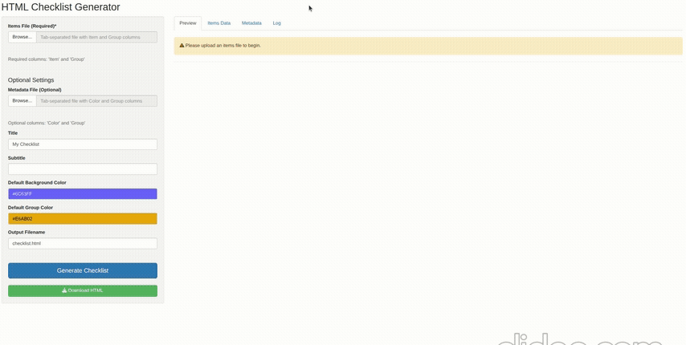
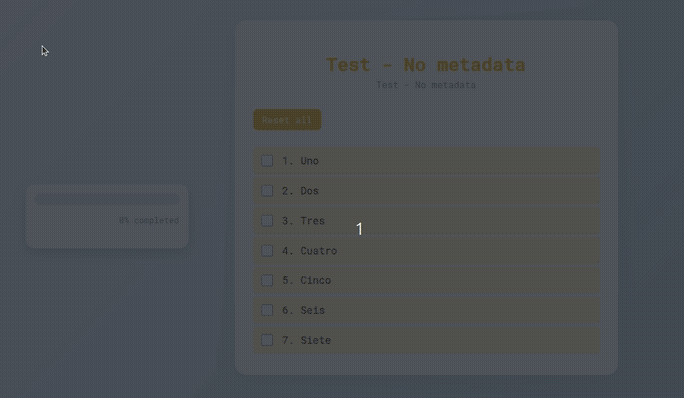
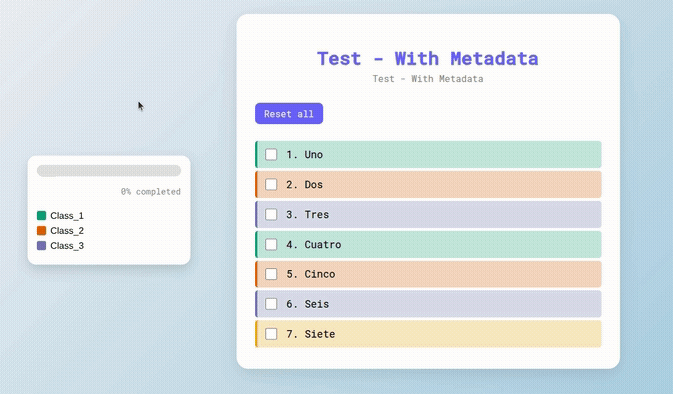

# html_checklist

This is a rudimentary R script to generate an interactive HTML checklist with a completion bar from a user provided item list.

## Shiny App Usage

You can create the checklist through an [online Shiny app](https://jaimicore.shinyapps.io/html-checklist-generator/).
The app is automatically deployed when changes are pushed to this repository.

For deployment setup, see [GitHub Actions Setup](.github/GITHUB_ACTIONS_SETUP.md).



## Command-Line Usage



A similar checklist as the one above above can be generated with the following command:

```bash
Rscript create_checklist.R                \
	-i example_input/items_simple.tab        \
	-t html_template/Checklist_template.html \
	-o results/Example_checklist_nometa.html \
	-c '#e6ab02'                             \
	--title 'title - No Metadata  '          \
	--subtitle 'Subtitle - No Metadata'      
```


&nbsp;

&nbsp;

Alternatively, users can provide a metadata file to assign categories to the items and create a fancier colorful checklist.



```bash
Rscript create_checklist.R                \
	-i example_input/items.tab               \
	-m example_input/metadata.tab            \
	-t html_template/Checklist_template.html \
	-o results/Example_checklist_meta.html   \
	-g '#e6ab02'                             \
	--title 'title - With Metadata'          \
	--subtitle 'Subtitle - With Metadata'              
```

&nbsp;

&nbsp;

## Requirements:

&nbsp;

**`-i` : items tab (Mandatory)**

A tab-delimited file containing two columns: 'Item' and 'Group', where 'Item' corresponds
to the text displayed in the checklist. 'Group' corresponds to the category names,
one assigned to each item. If no need to categorize the items then the 'Group' columns can be
empty and a default value will be used.


&nbsp;

Example items tab file (with and without groups). The 'Group' column may be empty but must be in the header.

```
Item   Group
Uno    Class_1
Dos    Class_2
Tres   Class_3
Cuatro Class_1
Cinco  Class_2
Seis   Class_3
Siete
```

```
Item   Group
Uno
Dos
Tres
Cuatro
Cinco
Seis
Siete
```

&nbsp;

**`-m` : metadata (Optional)**

A tab-delimited file containing two columns: 'Group' and 'Color' to simply assign
a color to each group (category) of items. The 'Group' column in the items and
metadata files must contain identical unique values, otherwise the script will
report an error.

&nbsp;

Example metadata file

```
Group	Color
Class_1	#1b9e77
Class_2	#d95f02
Class_3	#7570b3
```

&nbsp;

**`-t` : html_template (Mandatory)**

This html file is provided in the repository (`templates/Checklist_template.html`),
the script creates a copy and inserts the checklist and legend on it.
This example is customized to my needs, feel free to adapt it to yours.

&nbsp;

**`-o` : output_file (Mandatory)**

File name to the created checklist.

&nbsp;

**`--title` and `--subtitle` (Optional)**

Text that will be displayed as title and subtitle, respectively.
If not provided, the checklist will show a generic title and no subtitle.

&nbsp;

**`-c` : default background color (Optional)**

A default or user-defined color to the items in the checklist (`#6c63ff`  )

&nbsp;

**`-g` : default group color (Optional)**

A default or user-defined group color. This is assigned when metadata is not provided or the 'Group' column in the items file is empty (`#e6ab02`  )


&nbsp;

## Contributors + Report issues 

&nbsp;

Contributors
- [Jaime A Castro-Mondragon](https://jaimicore.github.io/) 

 &nbsp;

Use this space to report [issues](https://github.com/jaimicore/html_checklist/issues) related to this repository.
